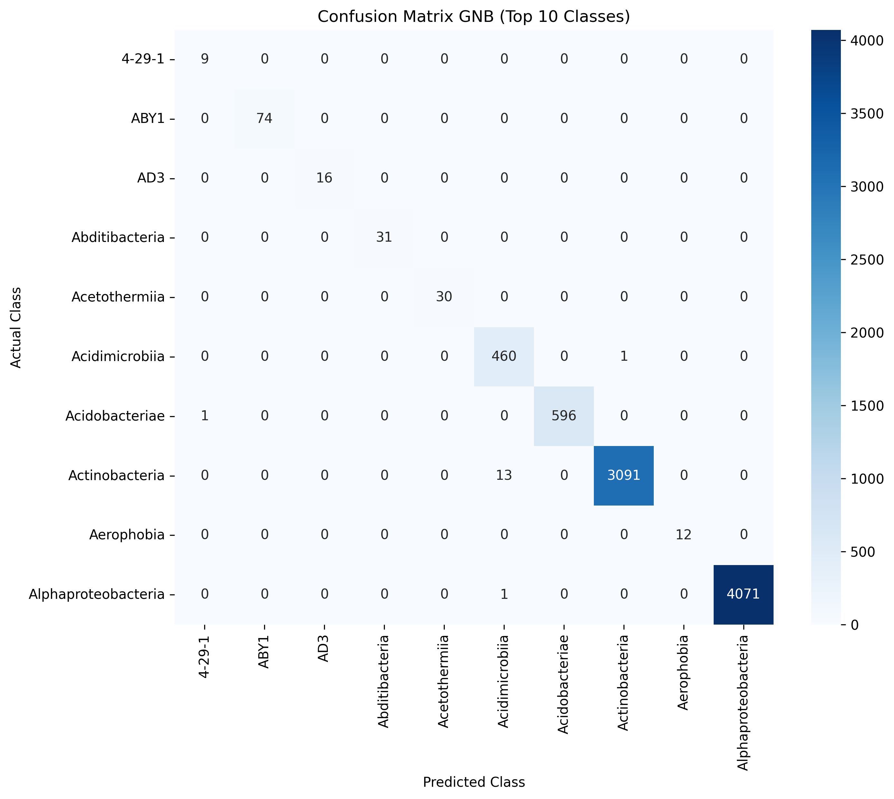
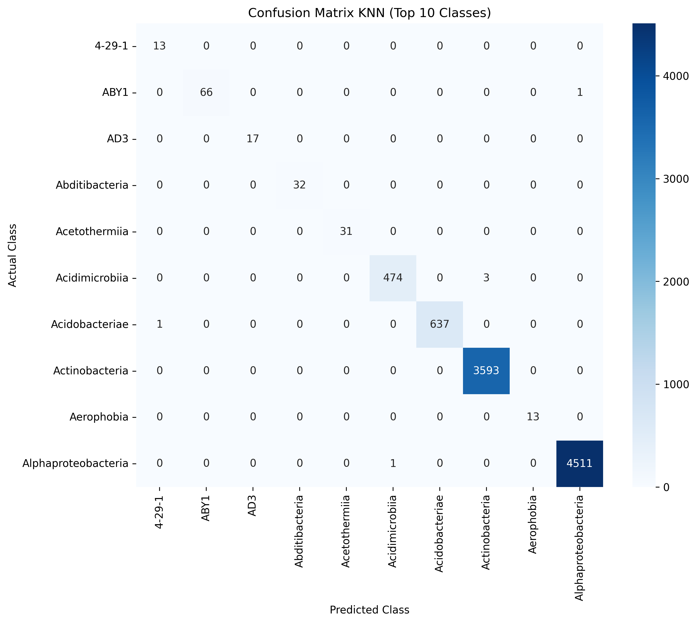
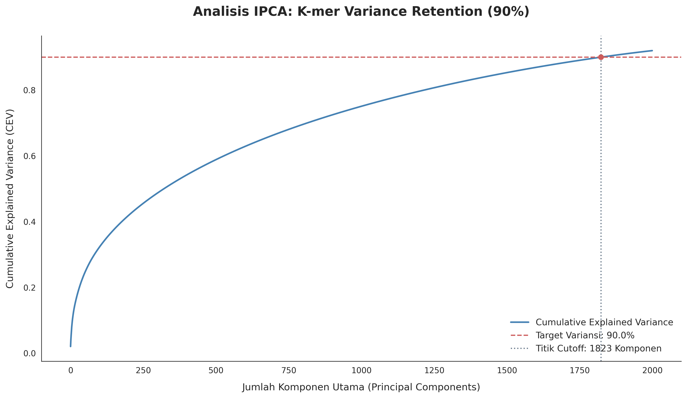
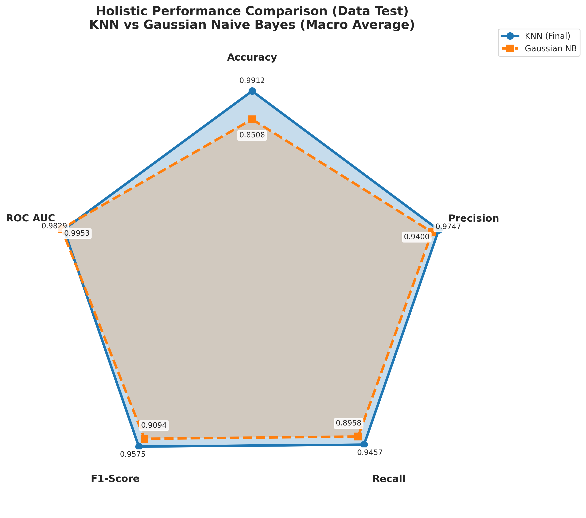

# 🌟 High-Dimensional Taxonomy Classification using IPCA, KNN, and Naive Bayes

Proyek ini merupakan implementasi machine learning untuk melakukan klasifikasi class taxonomy pada data berdimensi tinggi menggunakan metode **Incremental Principal Component Analysis (IPCA)** sebagai teknik reduksi dimensi, serta membandingkan performa algoritma **K-Nearest Neighbor (KNN)** dan **Naive Bayes (NB)** dalam proses klasifikasi.

Penelitian ini bertujuan untuk menganalisis efektivitas metode klasifikasi pada data berdimensi tinggi serta mengevaluasi pengaruh reduksi dimensi terhadap performa model machine learning.

---

# 🎯 Fokus Penelitian

Metode yang digunakan dalam penelitian ini meliputi:

## 🔹 Incremental Principal Component Analysis (IPCA)
Digunakan untuk:
- Mereduksi dimensi data berdimensi tinggi
- Mengurangi kompleksitas komputasi
- Mempertahankan informasi penting dari dataset

## 🔹 K-Nearest Neighbor (KNN)
Digunakan sebagai metode klasifikasi berbasis kedekatan jarak antar data.

## 🔹 Naive Bayes (NB)
Digunakan sebagai metode klasifikasi probabilistik berbasis Teorema Bayes.

---

# 🚀 Tujuan Project

- Mengimplementasikan metode Incremental PCA (IPCA) pada data berdimensi tinggi
- Membandingkan performa algoritma KNN dan Naive Bayes
- Mengevaluasi hasil klasifikasi menggunakan metrik evaluasi machine learning
- Menganalisis pengaruh reduksi dimensi terhadap performa model
- Mengembangkan pipeline machine learning untuk klasifikasi taxonomy

---

# 📂 Dataset

Dataset yang digunakan merupakan dataset berdimensi tinggi yang digunakan untuk proses klasifikasi class taxonomy.
---

# 🛠️ Teknologi yang Digunakan

| Teknologi | Deskripsi |
|---|---|
| Python | Bahasa pemrograman utama untuk analisis data dan machine learning |
| Pandas | Manipulasi dan preprocessing data |
| NumPy | Operasi numerik dan komputasi array |
| Scikit-learn | Implementasi IPCA, KNN, dan Naive Bayes |
| Matplotlib | Visualisasi data dan evaluasi model |
| Jupyter Notebook | Lingkungan pengembangan dan eksperimen model |

---

# 🧠 Metodologi Penelitian

Tahapan penelitian yang dilakukan:

1. Data Cleaning  
2. Data Preprocessing  
3. Feature Scaling  
4. Reduksi Dimensi menggunakan IPCA  
5. Pemodelan menggunakan:
   - K-Nearest Neighbor (KNN)
   - Naive Bayes (NB)
6. Evaluasi Model  
7. Perbandingan Performa Model

---

# 📊 Evaluasi Model

Model dievaluasi menggunakan beberapa metrik machine learning, antara lain:

- Accuracy
- Precision
- Recall
- F1-Score
- Confusion Matrix

---

# 📷 Visualisasi

## 🔹 Confusion Matrix Gaussian Naive Bayes


## 🔹 Confusion Matrix K-Nearest Neighbor


## 🔹 Visualisasi Variance IPCA


## 🔹 Radar Chart Macro Multiclass

---

# 📁 Struktur Project

```text
high-dimensional-taxonomy-classification/
│
├── data/
├── images/
├── notebook/
│   ├── 01_preprocessing.ipynb
│   └── 02_modeling_knn_nb.ipynb
│
├── requirements.txt
└── README.md
```

---

# 🧑‍💻 Cara Menjalankan Project

## 1. Clone Repository

```bash
git clone https://github.com/sains-data/high-dimensional-taxonomy-classification.git
```

---

## 2. Masuk ke Direktori Project

```bash
cd high-dimensional-taxonomy-classification
```

---

## 3. Install Dependencies

```bash
pip install -r requirements.txt
```

---

## 4. Jalankan Notebook

Buka Jupyter Notebook:

```bash
jupyter notebook
```

Kemudian jalankan notebook:
- `01_preprocessing.ipynb`
- `02_modeling_knn_nb.ipynb`

---

# 👥 Author

- Elia Meylani Simanjuntak

---

# 📫 Kontak

- LinkedIn: www.linkedin.com/in/elia-meylani
- GitHub: github.com/eliameylani

---

# 🙏 Ucapan Terima Kasih

Terima kasih kepada:
- Dosen pembimbing yang telah memberikan arahan dan bimbingan selama penelitian
- Seluruh pihak yang mendukung proses penelitian dan pengembangan project ini
- Program Studi Sains Data ITERA

---

# 🔗 Tautan Penting

- 📄 Repository GitHub: https://github.com/sains-data/high-dimensional-taxonomy-classification
